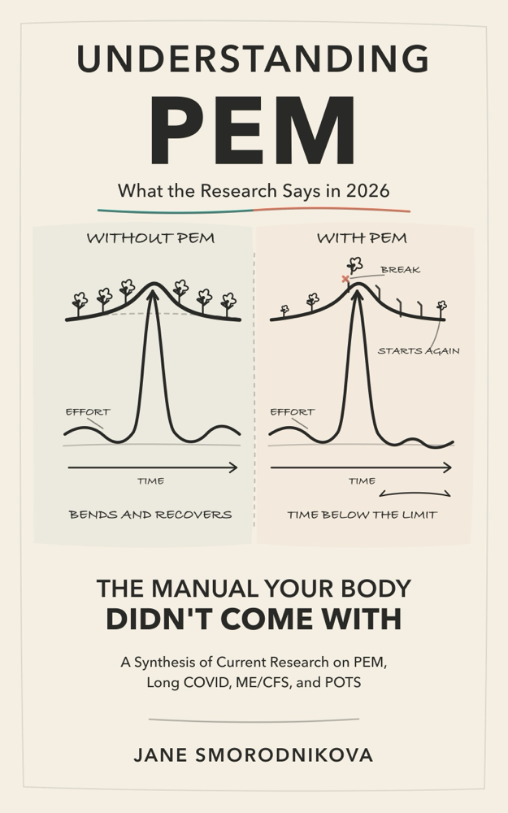

  

# Understanding PEM
### What the Research Says in 2026
#### The Manual Your Body Didn't Come With

A synthesis of current research on PEM, Long COVID, ME/CFS, and POTS.

**Author:** Jane Smorodnikova
**Published:** 2026
**License:** [CC BY-NC-ND 4.0](https://creativecommons.org/licenses/by-nc-nd/4.0/) — share freely with attribution, non-commercial, no derivatives

> **Author and affiliation.** Written by Jane Smorodnikova, founder and CEO of
> Welltory, in her individual capacity. This is not a Welltory product or a medical
> service, and nothing in it represents a clinical position, recommendation, or
> treatment recommendation of Welltory.
>
> **Not medical advice.** This book does not diagnose or treat, does not create a
> physician-patient relationship, and is not a basis for starting, stopping, or
> changing any medication, supplement, or dose. Those decisions belong with a
> clinician who knows your history.
>
> [Full disclosures and limitations](book/00-a-note-from-the-author.md)

## What this is

A plain-language map of how post-exertional malaise and the family of
infection-associated chronic conditions are currently understood. It was built
over a year of reading peer-reviewed studies, rehabilitation guidelines,
patient-led research, clinician interviews, and long-form recovery archives —
and it reports what that literature does and does not establish.

It is a review of published science, not a report of original findings. It is
not medical advice, and it is not a Welltory product.

## Who this is for

People living with Long COVID, ME/CFS, POTS, MCAS, and related post-infectious
conditions with post-exertional malaise — and the people who care for them.

## How to read it

- **[Online, chapter by chapter](book/)** — every chapter is a separate file
- **Download:**

- [PDF for reading on screen (A4)](downloads/understanding-pem-2026-screen-a4.pdf) — 3.0 MB
- [PDF for printing (6×9 in)](downloads/understanding-pem-2026-print-6x9.pdf) — 3.1 MB
- [EPUB for Apple Books, Kobo, Google Play Books](downloads/understanding-pem-2026.epub) — 1.4 MB
- [EPUB optimised for Kindle](downloads/understanding-pem-2026-kindle.epub) — 1.9 MB

The screen PDF is A4 with wide margins so the line length stays readable. The
print PDF is 6×9 inches with a binding margin, sized for print-on-demand. The
Kindle EPUB carries the illustrations as images, because Kindle does not render
inline vector graphics reliably.

## Contents

1. [A Note from the Author](book/00-a-note-from-the-author.md)
2. [Introduction](book/01-introduction.md)
3. [Chapter 1. Fatigue is not the right word](book/02-fatigue-is-not-the-right-word.md)
4. [Chapter 2. The thermostat that won’t turn off](book/03-the-thermostat-that-wont-turn-off.md)
5. [Chapter 3. Five diagnoses, one problem](book/04-five-diagnoses-one-problem.md)
6. [Chapter 4. Why standing is harder than walking](book/05-why-standing-is-harder-than-walking.md)
7. [Chapter 5. Tools that work every day](book/06-tools-that-work-every-day.md)
8. [Chapter 6. Pacing: the science of not overdoing it](book/07-pacing-the-science-of-not-overdoing-it.md)
9. [Chapter 7. Food as a tool, not a diet](book/08-food-as-a-tool-not-a-diet.md)
10. [Chapter 8. Sleep architecture, not sleep hours](book/09-sleep-architecture-not-sleep-hours.md)
11. [Chapter 9. Data over feelings](book/10-data-over-feelings.md)
12. [Chapter 10. Talking to your doctor](book/11-talking-to-your-doctor.md)
13. [Chapter 11. Psychological support ≠ “it’s all in your head”](book/12-psychological-support-is-not-its-all-in-your-head.md)
14. [Chapter 12. Explaining to those around you](book/13-explaining-to-those-around-you.md)
15. [Conclusion. Recovery as a project](book/14-conclusion-recovery-as-a-project.md)
16. [Reading list](book/15-reading-list.md)
17. [Appendix 1. Symptom diary](book/16-appendix-1-symptom-diary.md)
18. [Appendix 2. Doctor summary](book/17-appendix-2-doctor-summary.md)
19. [Glossary](book/18-glossary.md)

## License

This work is licensed under
[CC BY-NC-ND 4.0](https://creativecommons.org/licenses/by-nc-nd/4.0/). You may
copy and redistribute it in any medium or format, with attribution, for
non-commercial purposes, without modifications. See [LICENSE.md](LICENSE.md).

**Scope.** Except where otherwise noted, the original text and original
illustrations are licensed under CC BY-NC-ND 4.0. Third-party quotations,
excerpts, figures, trademarks, names, and other third-party materials remain the
property of their respective rights holders and are not licensed under this
Creative Commons license.

## Disclaimer

This book is not medical advice. It does not diagnose, treat, or replace
consultation with a qualified healthcare provider. The author is founder and
CEO of Welltory; that affiliation does not mean Welltory endorses any content
herein, and the Welltory app does not diagnose, predict, monitor, prevent,
treat, or mitigate any disease or medical condition. The full statement is in
[A Note from the Author](book/00-a-note-from-the-author.md).

## Updates and corrections

Research current as of mid-2026. Figures in a field moving this fast will date.
If you spot an error, [open an issue](https://github.com/smorodnikova/understanding-pem-2026_book/issues) — corrections are
tracked in [CHANGELOG.md](CHANGELOG.md).
